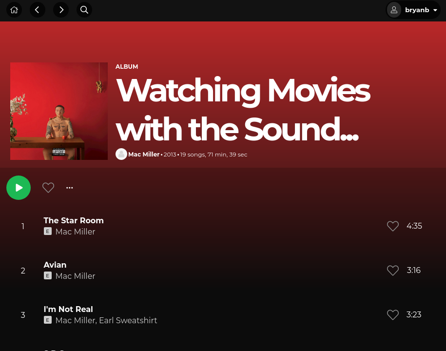
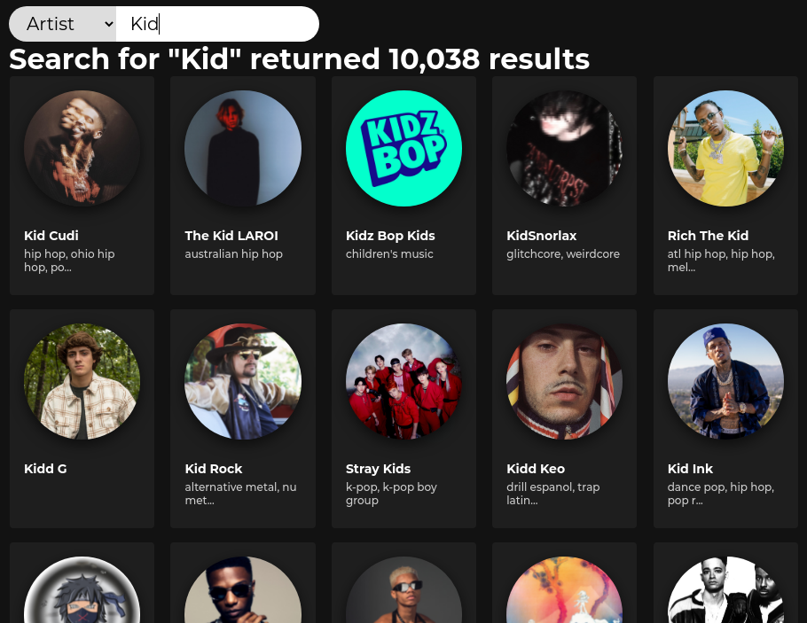
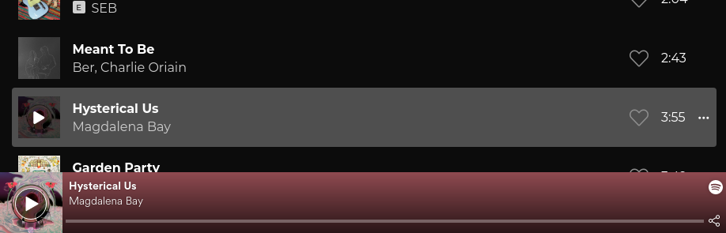
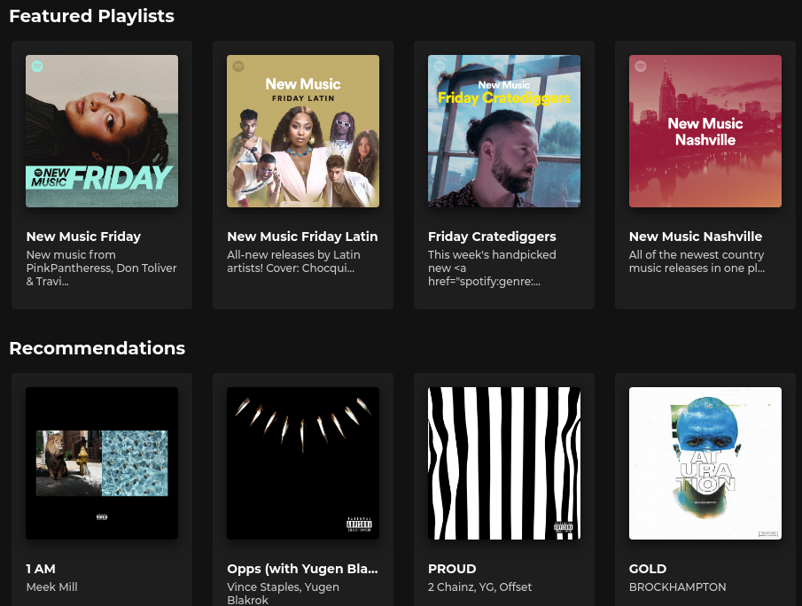
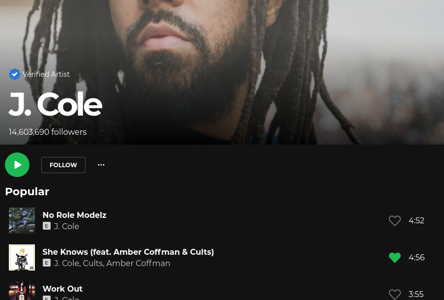

# Clonify

1. <a href="#what-is-clonify">About</a>
1. <a href="#features">Features</a>
1. <a href="#technologies">Technologies</a>
1. <a href="#setup">Setup</a>

## What is Clonify?
Clonify is a clone of Spotify. The main focus for this project is to replicate the major functionalities of a music application, while using Spotify as inspiration for styling.

The data for the application is largely powered by Spotify's API. This provides up-to-date data and allows for powerful functionalities, such as search and music reccomendations.

Check out the live demo <a href="https://clonify-music.herokuapp.com/">here</a>!

<a href="https://github.com/bryanlancy/Clonify/wiki">Explore the docs »</a>

## Features
### Search for music
Search for new music by song, artist, or playlist and get results that are powered directly by Spotify's expansive music database.

###  Listen to music
After finding a song you like, or if you're curious about a new song or playlist, just press the green play button and you can stream the music with Spotify's embedded music player.

### Get recommended music
Using songs that you've liked through Clonify, the application will begin recommending suggested music based off of your preferences.

### Get details on your favorite music and artists
Find all the related music for an artist, song, and playlist. Being powered by Spotify's API, there's a lot of music.

## Technologies

Frontend

    
    
    

    
    

Backend

    
    
    

APIs

    

## Setup

 <em>
    The following setup assumes that you have PostgreSQL installed and have permissions to add a new user. Documentation can be found <a href="https://www.postgresql.org/">here</a>.
</em>
 
<em>
    You will also need access to Spotify's API. Specifically, you will need a client id and secret key as this application uses a client credentials flow for authorization with Spotify's API. Sign up or sign in to the Spotify Developer dashboard <a href="https://developer.spotify.com/dashboard/">here</a>.
</em>

  

1. **Clone repository & install Node dependencies**
    1. Clone the project with: 
    `git clone https://github.com/bryanlancy/Clonify.git`

    1. In the root project directory run the command: 
    `npm run install`
1. **Setup the backend environment**
    1. Make a copy of the `.env.example` file found in the `backend` folder and rename it to `.env`.
    1. In the `.env` file, replace all values surrounded in `< >` with the corresponding information. Unless you have already done so, you can generate these values now.

        - `DB_USERNAME` - PostgreSQL user name
        - `DB_PASSWORD` - PostgreSQL user password
        - `DB_DATABASE` - PostgreSQL database name
            - database will be created in a later step.
        - `JWT_SECRET` - JSON Web Token Secret
            - should be unique and secure.
        - `SPOTIFY_CLIENT_ID` - Spotify Client ID
        - `SPOTIFY_CLIENT_SECRET` - Spotify Client Secret

         

        :warning: *The `.env.example` is tracked by git version control, **do not** save any sensitive information in this file.*
    1. **Create PostgreSQL user.**
        - In your terminal run, `psql`, to start PostgreSQL's interactive terminal.
        - `CREATE USER <DB_USERNAME> WITH PASSWORD '<DB_PASSWORD>' CREATEDB;`. Remember to replace the values in `< >` with the values we created in the previous step.
        
1. **Create & seed the database**
    1. In your terminal, navigate to the `backend` folder found in the main project directory.
    1. Then run, `npm run db-setup`. This will run a series of commands that should automatically set up your database. If any errors occur, you can run the commands individually, in this order.
        1. `npm run db-create`
        1. `npm run db-migrate`
        1. `npm run db-seed`
1. **Start the application**
    1. In your terminal, navigate to the main project folder.
    1. Then run `npm run fullstart`. This will start the backend and frontend server.  
        - Each server can be started manually by navigating to the respective folder, `frontend` and `backend`, and running the command `npm start`.
    1. In your browser navigate to <a href="http://localhost:3000">localhost:3000</a>
